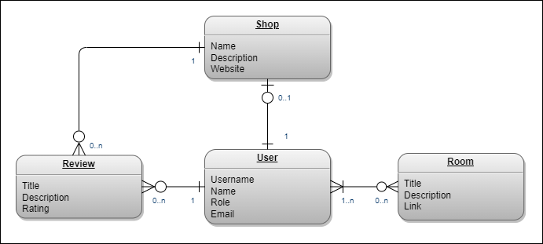
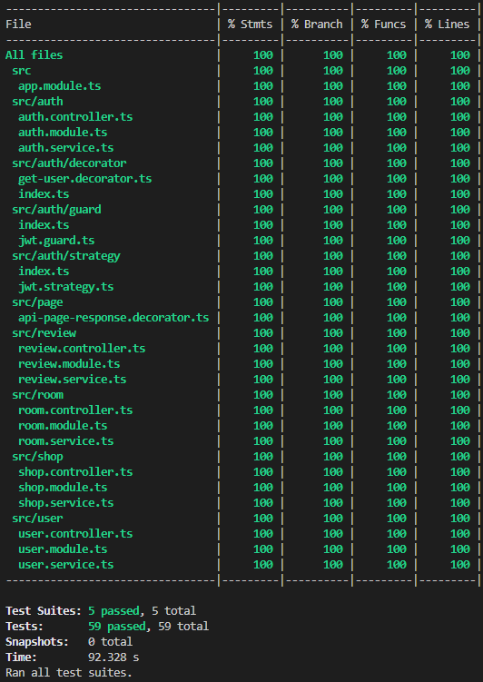
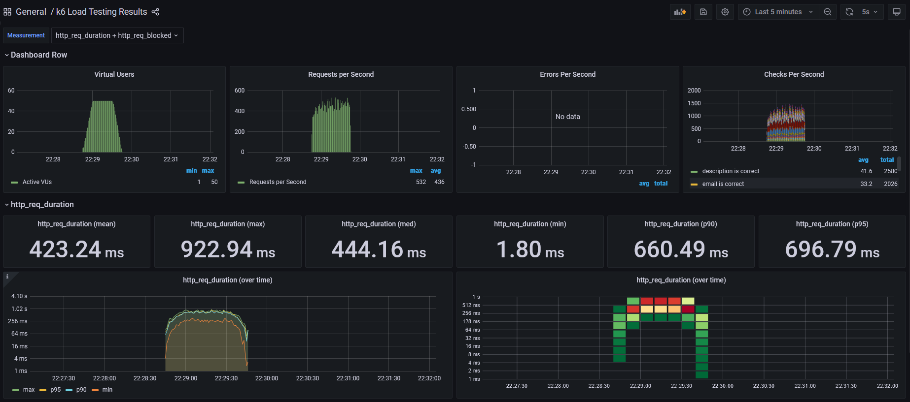

<p align="center">
  <a href="http://nestjs.com/" target="blank"></a>
</p>

<p align="center">
  
  
  <a href="https://github.com/prettier/prettier">
    
  </a>
  <a href="https://www.codefactor.io/repository/github/pedrocorreia105/nestapi/overview/master">
    
  </a>
  <a href="https://codecov.io/gh/PedroCorreia105/NestApi/branch/master">
    
  </a>
  <a href="https://github.com/PedroCorreia105/NestAPI/actions/workflows/build.yml">
    
  </a>
  <a href="https://github.com/PedroCorreia105/NestApi/blob/master/LICENCE">
    
  </a>
  
</p>

<p align="center">
  <sub><sup>
    <a href="#description">Description</a> •
    <a href="#stack">Stack</a> •
    <a href="#installation">Installation</a> •
    <a href="#database">Database</a> •
    <a href="#entity-relationship-diagram">Entity Relationship Diagram</a> •
    <a href="#running-the-app">Running the app</a> •
    <a href="#endpoints">Endpoints</a> •
    <a href="#test">Test</a> •
    <a href="#video-tutorials">Video Tutorials</a> •
    <a href="#helpful-repos">Helpful repos</a> •
    <a href="#node-best-practices">Node best practices</a> •
    <a href="#license">License</a>
  </sub></sup>
</p>

## Description

A dockerized boilerplate <a href="http://nodejs.org" target="blank">Node.js</a> API using <a href="https://nestjs.com/">NestJS</a> and <a href="https://www.typescriptlang.org/">Typescript</a> that includes Authentication, Input validation, Error handling, Logging, API versioning and Pagination.

## Stack

<table align="center">
  <tr>
    <td align="right">
      <b>Language</b>
    </td>
    <td align="left">
      <a href="https://www.typescriptlang.org/">Typescript</a>
    </td>
  </tr>
  <tr>
    <td align="right">
      <b>Framework</b>
    </td>
    <td align="left">
      <a href="https://nestjs.com/">NestJS</a>
    </td>
  </tr>
  <tr>
    <td align="right">
      <b>Database</b>
    </td>
    <td align="left">
      <a href="https://www.postgresql.org/">Postgres</a>
    </td>
  </tr>
  <tr>
    <td align="right">
      <b>ORM</b>
    </td>
    <td align="left">
      <a href="https://www.prisma.io/">Prisma</a>
    </td>
  </tr>
  <tr>
    <td align="right">
      <b>E2E Testing</b>
    </td>
    <td align="left">
      <a href="https://jestjs.io/">Jest</a> &
      <a href="https://pactumjs.github.io/">Pactum</a>
    </td>
  </tr>
  <tr>
    <td align="right">
      <b>Load Testing</b>
    </td>
    <td align="left">
      <a href="https://k6.io/">k6</a>
    </td>
  </tr>
  <tr>
    <td align="right">
      <b>Documentation</b>
    </td>
    <td align="left">
      <a href="https://swagger.io/tools/swagger-ui/">Swagger</a>
    </td>
  </tr>
  <tr>
    <td align="right">
      <b>Linter</b>
    </td>
    <td align="left">
      <a href="https://prettier.io/">Prettier</a>
    </td>
  </tr>
  <tr>
    <td align="right">
      <b>CI</b>
    </td>
    <td align="left">
      <a href="https://github.com/features/actions">Github Actions</a>
    </td>
  </tr>
 </table>

## Installation

```bash
$ npm install
```

## Database

```bash
# Start postgres container and push migrations
$ npm run db:dev:restart

# Generate migrations
$ npm run prisma:dev:migrate

# Seed data
$ npx prisma db seed

# View data
$ npx prisma studio
```

## Entity Relationship Diagram

<p align="center">
  
</p>

## Running the app

```bash
# Development
$ npm run start

# Watch mode
$ npm run start:dev

# Production
$ npm run start:prod
```

## Endpoints

```bash
# API
http://localhost:8080

# Swagger
http://localhost:8080/api

# Grafana
http://localhost:3000/d/k6/k6-load-testing-results
```

## Test

```bash
# Run e2e tests
$ npm run test

# Run tests with coverage
$ npm run test:cov

# Run load tests
$ npm run test:load
```

<table>
  <tr>
    <td valign="center" width="40%"></td>
    <td valign="middle"></td>
  </tr>
</table>

## Video Tutorials

- [NestJs Course for Beginners - Create a REST API](https://www.youtube.com/watch?v=GHTA143_b-s)
- [Building a REST API with NestJS and Prisma - Marc Stammerjohann](https://www.youtube.com/watch?v=mmbd5hcQUaY)

## Helpful repos

- https://github.com/vladwulf/nestjs-api-tutorial
- https://github.com/marcjulian/nestjs-prisma-workshop
- https://github.com/brocoders/nestjs-boilerplate
- https://github.com/deboraornellas/nestjs-testing
- https://github.com/makinhs/medium-article-code-cov
- https://github.com/tkssharma/nestjs-advance-course

## Node best practices

- https://github.com/goldbergyoni/nodebestpractices

## License

This project is licensed under the MIT License - see the [LICENSE](https://github.com/PedroCorreia105/NestApi/blob/master/LICENCE) file for details.
